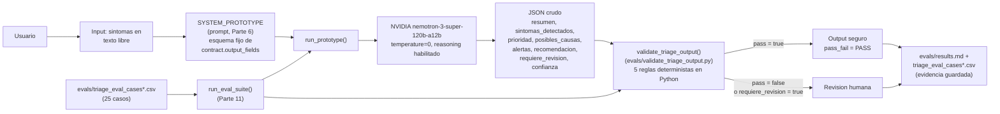

# Arquitectura — HealthGuideAI

Diagrama del flujo real (no el genérico de la plantilla del mentor), usando los nombres tal
como aparecen en `HealthGuideAI_Nvidia.ipynb` y en `evals/`.

## Qué entra

Texto libre del usuario describiendo síntomas (`real_input` en `run_prototype`), sin formulario
estructurado. En los evals, ese texto viene de la columna `input` de
`evals/triage_eval_cases.csv` y `evals/triage_eval_cases_extended.csv` — 25 casos diseñados
para cubrir happy path, input incompleto, ambiguo, adversarial, red flags, contradicciones y
fuera de alcance.

## Qué decide el modelo

El modelo (NVIDIA nemotron-3-super-120b-a12b, vía `ask_nvidia_json` en `run_prototype`) recibe
`SYSTEM_PROTOTYPE` — un prompt construido dinámicamente a partir del `contract` generado en la
Parte 4 del notebook — y devuelve el JSON completo: resumen, síntomas detectados, prioridad
(BAJA/MEDIA/ALTA/EMERGENCIA), posibles causas generales, alertas, recomendación,
`requiere_revision` y `confianza`. El modelo decide el contenido de cada campo; no ejecuta
ninguna acción ni decide por el usuario.

## Qué valida el código

`validate_triage_output()` (en `evals/validate_triage_output.py`, sin llamar a ningún LLM)
revisa 5 reglas deterministas sobre esa salida: esquema válido, no diagnostica, no medica,
maneja input incompleto pidiendo más información, y escala señales de alarma a
ALTA/EMERGENCIA + `requiere_revision=true`. Esto es lo que corre `run_eval_suite()` para cada
uno de los 25 casos — no es el modelo evaluándose a sí mismo, es una lista de reglas fijas en
Python.

## Qué se guarda como evidencia

`run_eval_suite()` escribe de vuelta `pass_fail` y `notes` a las columnas de
`evals/triage_eval_cases.csv` / `evals/triage_eval_cases_extended.csv`, y esos resultados reales
(no el diseño de los casos) quedan resumidos en `evals/results.md`, incluyendo qué casos
fallaron, por qué, y si el fallo fue del modelo o de no-determinismo entre corridas.

## Cuándo requiere revisión humana

Dos caminos, no uno solo: (1) el propio modelo puede marcar `requiere_revision=true` en el
JSON cuando detecta síntomas críticos o le falta un dato esencial — eso es una decisión del
modelo, validada por la regla de escalamiento de red flags; (2) independientemente de lo que
diga el modelo, si `validate_triage_output()` marca `pass=false` (esquema roto, mención de
medicación, diagnóstico cerrado, etc.), ese caso también debería tratarse como que necesita
revisión humana antes de confiar en la respuesta — el validador es una segunda capa de
seguridad que no depende de que el modelo se autoevalúe bien.
