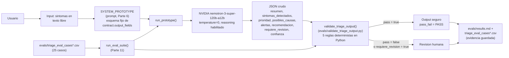
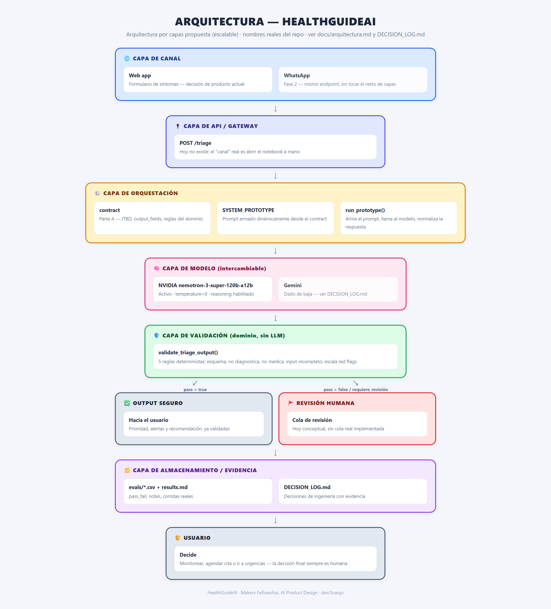
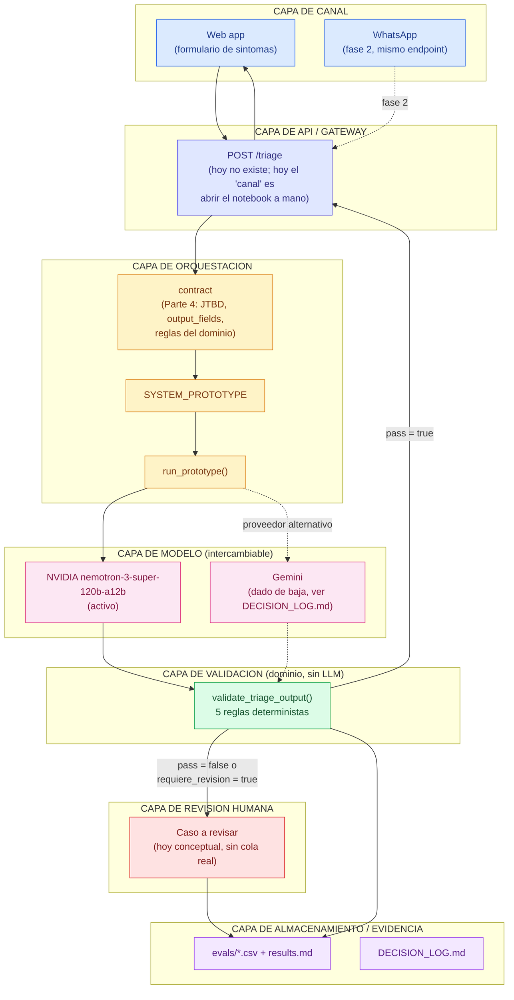

# Arquitectura — HealthGuideAI

Este documento tiene dos partes. La primera es el flujo real tal como corre hoy, dentro de
`HealthGuideAI_Nvidia.ipynb` (lo que se puede correr y mostrar ahora mismo). La segunda es la
arquitectura por capas hacia la que apunta el proyecto para dejar de depender de correr un
notebook celda por celda — la decisión de producto que la acompaña está en `DECISION_LOG.md`.

## 1. Flujo actual (lo que corre hoy)

Este diagrama no cambió respecto a la versión anterior porque sigue siendo la descripción
correcta de lo que hay implementado — un notebook, no un servicio. La arquitectura por capas de
la sección 3 es hacia dónde se movería este mismo flujo si se convierte en producto.

## 2. Las siete preguntas de arquitectura

El mentor pidió que la arquitectura responda explícitamente a entradas, procesamiento, modelo,
validaciones, almacenamiento, salida y usuario. Acá, con nombres reales del repo:

| Pregunta | Respuesta |
| --- | --- |
| **Entradas** | Texto libre describiendo síntomas (`real_input` en `run_prototype`). En los evals viene de la columna `input` de `evals/triage_eval_cases.csv` y `triage_eval_cases_extended.csv` — 25 casos que cubren happy path, input incompleto, ambiguo, adversarial, red flags, contradicciones y fuera de alcance. No hay formulario estructurado; el sistema tiene que extraer la información del lenguaje natural. |
| **Procesamiento** | `contract` (Parte 4 del notebook) define el esquema de salida y las reglas del dominio; con eso se arma dinámicamente `SYSTEM_PROTOTYPE`, el prompt que efectivamente se envía. `run_prototype()` es la función que orquesta esto: arma el prompt, llama al modelo y normaliza la respuesta (por ejemplo, `.strip().upper()` sobre `prioridad` antes de que cualquier validación la toque). |
| **Modelo** | NVIDIA `nemotron-3-super-120b-a12b`, vía `ask_nvidia_json()`, con `temperature=0` y reasoning habilitado. Decide el contenido semántico de cada campo del JSON — resumen, causas posibles, redacción de la recomendación — pero no ejecuta ninguna acción ni decide por el usuario. |
| **Validaciones** | `validate_triage_output()` en `evals/validate_triage_output.py`, sin llamar a ningún LLM: esquema válido, no diagnostica, no medica, maneja input incompleto pidiendo más información, y escala red flags a prioridad ALTA/EMERGENCIA + `requiere_revision=true`. Es una lista de reglas fijas en Python, documentada como "no robusta de verdad" porque es keyword-based y se puede colar una paráfrasis. |
| **Almacenamiento** | Hoy es archivo, no base de datos: `run_eval_suite()` escribe `pass_fail` y `notes` de vuelta en los CSV de `evals/`, y el resumen humano de esas corridas queda en `evals/results.md`. Las decisiones de ingeniería (qué modelo, qué canal) quedan en `DECISION_LOG.md`. |
| **Salida** | El JSON del contrato (`resumen`, `sintomas_detectados`, `prioridad`, `posibles_causas`, `alertas`, `recomendacion`, `requiere_revision`, `confianza`), ya pasado por el validador. Si el validador lo marca inseguro, la salida real hacia el usuario no debería ser el JSON del modelo tal cual, sino la indicación de que el caso pasa a revisión humana. |
| **Usuario** | Adulto con síntomas que no sabe si esperar, agendar cita o ir a urgencias (ver `.claude/CLAUDE.md` sección 1). Recibe la orientación o la indicación de que su caso necesita revisión — nunca una decisión cerrada; la decisión final de qué hacer siempre es humana. |

## 3. ¿Dónde vive la inteligencia del sistema?

No en un solo lugar, y eso es intencional. Repartida así:

- **En el modelo:** la parte que de verdad necesita lenguaje natural — entender síntomas
  descritos con las palabras de quien los tiene, generar un resumen, redactar una
  recomendación con tono apropiado.
- **En las reglas/validadores:** la parte que no se le puede confiar a un modelo no
  determinista — que el JSON tenga los campos correctos, que no se cuele un nombre de
  medicamento, que un red flag conocido escale sí o sí.
- **En los datos (evals):** el criterio de qué es una respuesta aceptable no está en la cabeza
  de nadie del equipo, está en los 25 casos de `evals/*.csv` con su `expected_priority` y
  `expected_guardrail` — son la especificación ejecutable del comportamiento esperado.
- **Nunca en el workflow ni en el usuario:** el sistema no ejecuta ninguna acción por su cuenta
  (`AI_CAPABILITIES.planear = False` en el notebook) y no decide en lugar del usuario.

Esta distribución es la razón por la que las tres corridas de evals con el mismo prompt dieron
tres resultados distintos (72%, 80%, 96%) y aun así el sistema se mantiene razonablemente
seguro: la inteligencia semántica del modelo es no determinista, pero la capa de validación no
lo es, y esa segunda capa es la que de verdad decide si algo es seguro de mostrar.

## 4. Frontera IA vs software

- **Qué decide la IA:** el contenido de cada campo del JSON — cómo se resume el caso, qué
  causas generales se mencionan, cómo se redacta la recomendación.
- **Qué valida el software:** que ese contenido respete las reglas no negociables del dominio
  (`validate_triage_output`) — sin excepciones basadas en qué tan bien redactado suene el
  texto del modelo. El software no le pregunta al modelo si su propia respuesta está bien; la
  revisa con reglas fijas, externas al modelo.
- **Qué revisa el humano:** cualquier caso donde el modelo marque `requiere_revision=true` o
  donde el validador marque `pass=false` — dos caminos independientes de escalamiento, no uno
  solo, precisamente para no depender de que el modelo se autoevalúe bien.

## 5. Arquitectura por capas (propuesta escalable)

El notebook resuelve el prototipo, pero todo vive en un solo archivo: modelo, validación,
evidencia y "producto" están mezclados en las mismas celdas. Para que esto crezca sin que cada
cambio de proveedor de modelo rompa el resto (como pasó con el bug de contrato no unificado
entre NVIDIA y Gemini — ver `evals/results.md`), la propuesta es separar el mismo flujo en
capas con una responsabilidad cada una, donde una capa solo le habla a la de al lado:

Por qué estas capas y no otras:

- **Canal separado de API:** es lo que permite agregar WhatsApp en fase 2 (ver
  `DECISION_LOG.md`, decisión 2) sin tocar nada de abajo — el canal solo le manda texto al
  mismo endpoint.
- **Modelo como capa intercambiable:** es la lección real del bug de Gemini vs NVIDIA. Si el
  contrato de salida es el mismo sin importar el proveedor, cambiar o comparar modelos es un
  problema de esta capa únicamente, no de todo el sistema.
- **Validación separada del modelo:** es la capa que hoy ya existe como módulo independiente
  (`evals/validate_triage_output.py` no importa nada de NVIDIA ni de Gemini) — la propuesta es
  simplemente reconocerla como su propia capa arquitectónica, no solo como "la Parte 11 del
  notebook".
- **Evidencia y escalamiento como capas propias:** para que la trazabilidad (qué pasó, por qué,
  qué se decidió) no dependa de que alguien se acuerde de escribirla a mano en un notebook.

Esta es una arquitectura en capas simple (layered architecture) y no algo más elaborado tipo
hexagonal/microservicios a propósito: el equipo son dos personas en una fase de prototipo, y una
arquitectura por capas ya resuelve el problema real que tenemos (proveedor de modelo acoplado al
resto) sin la sobrecarga de mantener múltiples servicios desplegados por separado.

## 6. Decisión de producto: dónde vive el agente

Documentado con evidencia y alternativas comparadas en `DECISION_LOG.md` (decisión 2), y ya
implementado: **web app + API**, en `backend/` (FastAPI, capas API → orquestación → modelo →
validación → evidencia) y `frontend/` (React + Vite, la capa de canal), probado de punta a
punta con llamadas reales a NVIDIA. **WhatsApp queda como canal de fase 2**, agregable sin
reescribir el modelo ni el validador gracias a que el canal quedó desacoplado de la
orquestación en la sección 5 — sería un segundo cliente de `POST /api/triage`, no una
reescritura. Ver `backend/README.md` y `frontend/README.md` para cómo correrlo.

## 7. Cuándo requiere revisión humana

Dos caminos, no uno solo: (1) el propio modelo puede marcar `requiere_revision=true` en el
JSON cuando detecta síntomas críticos o le falta un dato esencial — eso es una decisión del
modelo, validada por la regla de escalamiento de red flags; (2) independientemente de lo que
diga el modelo, si `validate_triage_output()` marca `pass=false` (esquema roto, mención de
medicación, diagnóstico cerrado, etc.), ese caso también debería tratarse como que necesita
revisión humana antes de confiar en la respuesta — el validador es una segunda capa de
seguridad que no depende de que el modelo se autoevalúe bien.
